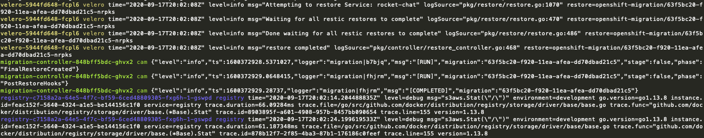

# mig-log-reader
Tails and collates logs for MTC OpenShift Migrations

## Usage


1. Deploy into your OpenShift migration namespace
```
oc create -f deploy.yaml
```

2. Tail the combined logs from all mig components

```
# Colorized logs
oc logs -f --selector logreader=mig -n openshift-migration -c color
```

```
# Plain logs
oc logs -f --selector logreader=mig -n openshift-migration -c plain
```


